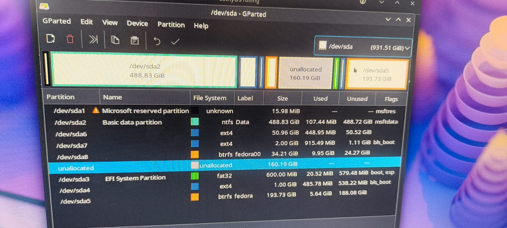
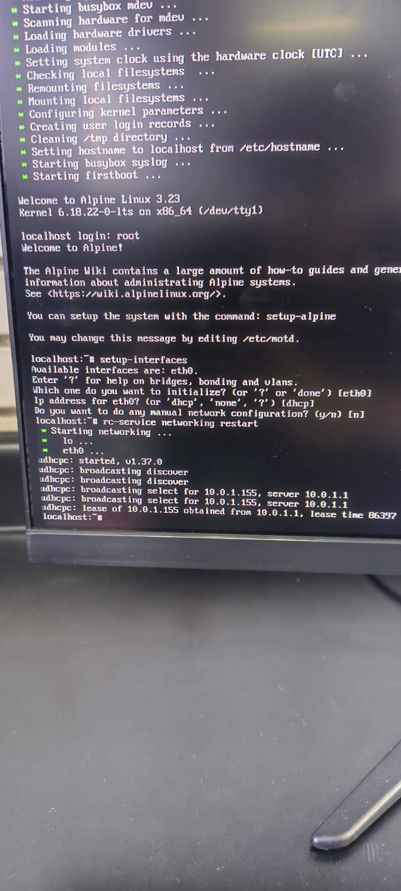
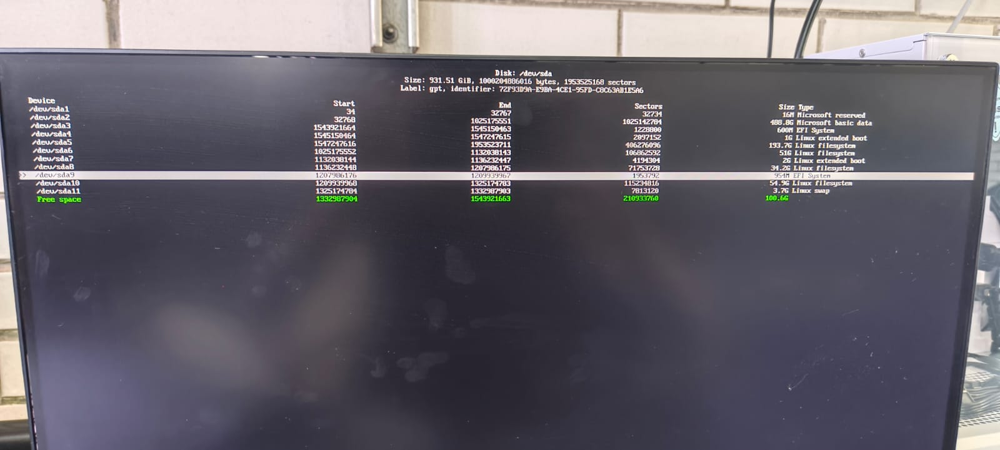
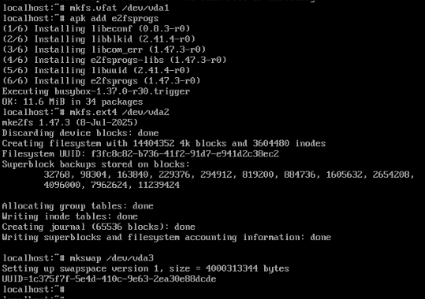

#+TITLE: Preparación para la Instalación Nativa de las distribuciones dadas.
#+AUTHOR: Equipo Alpine White
#+DATE: [2026-04-20 lun]
#+OPTIONS: toc:2
#+PROPERTY: header-args :exports both :eval never
#+LATEX_CLASS: article
#+LATEX_CLASS_OPTIONS: [11pt, letterpaper]
#+LATEX_HEADER: \usepackage[margin=2.5cm]{geometry}      % Márgenes decentes
#+LATEX_HEADER: \usepackage[utf8]{inputenc}
#+LATEX_HEADER: \usepackage{palatino}                   % Tipografía elegante
#+LATEX_HEADER: \usepackage{xcolor}                     % Colores personalizados

* Información General
- *Equipo:*
  - Arreguín Salgado Gael Emiliano
  - López Pérez Mariana
  - Nieto Gallegos Isaac Julián

- *Distribución elegida:* Alpine Linux

* Alpine Linux

** Despejar espacio para la instalación

La instalación en bare metal de la distribución elegida se realizará sobre un equipo de cómputo del Laboratorio De Sistemas Operativos de la facultad.

Estos equipos tienen los siguientes medios de almacenamiento:

- Un disco NVME. Marcado como /dev/nvme0n1
- Un disco de estado sólido. Marcado como /dev/sda

Al disco NVME no hay que tocar nada. Debemos reducir alguna de las particiones ya existentes en el disco de estado sólido para realizar nuestra instalación.

En mi caso concreto, reduje /dev/sda8 para obtener 160GB de espacio disponibles.

** Conexión a internet

Alpine Linux viene con una instalación muy mínima por default. Por esto, vamos a necesitar descargar más herramientas de Internet. Evidentemente para esto, necesitamos conectarnos a internet.

Para esto, ejecutaremos un script integrado en Alpine llamado *setup-interfaces*. Ya que necesitamos conectarnos por Ethernet, las opciones por default nos resultan suficientes para esto.

Una vez hecho esto, corremos:

#+begin_src bash :eval never
rc-service networking restart
#+end_src

Para cargar las configuraciones.

Una vez hecho esto, configuramos la lista de repositorios remotos de la cual nuestro sistema Live obtendrá los paquetes. Esto lo hacemos con:

#+begin_src bash :eval never
setup-apkrepos
#+end_src

Hecho esto, podemos comenzar a trabajar.

** Creación de las particiones necesarias

Alpine Linux, al igual que distribuciones dedicadas a correr en ambientes reducidos como Arch Linux no tiene un programa de instalación con interfaz gráfica. En su lugar, su imágen de instalación en realidad es una Live USB que carga el sistema en memoria y desde ahí nos permite tanto trabajar como instalarlo en un disco duro.

En esta live USB existen dos scripts dedicados a la instalación del sistema:

- setup-alpine
- setup-disk

El primer script es un asistente de instalación interactivo (TUI) que nos irá haciendo preguntas para instalar Alpine. El problema de este script es que espera un disco completo para realizar su instalación, ya que realiza el particionado automáticamente.

Entonces, usaremos el segundo script. El cual espera un sistema raíz ya montado y preparado en */mnt/* para funcionar.

Vamos a preparar tres particiones: la partición raíz, la partición swap y la partición */boot*, esta última preparada para arranque en UEFI, que es el arranque para el que están preparadas las computadoras de este laboratorio.

Repartiendo 64GB de almacenamiento entre estas particiones, asignamos los siguientes tamaños:

|-----------+-----------------|
| Particion | Tamaño asignado |
|-----------+-----------------|
| Boot      | 1GB             |
|-----------+-----------------|
| Root      | 59GB            |
|-----------+-----------------|
| Swap      | 4GB             |
|-----------+-----------------|

*** Preparación

Alpine Linux viene solamente con la versión de busybox de fdisk. Esta versión no nos resulta útil, ya que solo nos permite trabajar con tablas MBR. Instalaremos cfdisk con:

#+begin_src bash :eval never
apk add cfdisk
#+end_src

*** Particiones

Secuencialmente vamos construyendo las particiones en el tamaño y formatos necesarios con la herramienta cfdisk. Esta herramienta resulta bastante intuitiva. Al final, nos queda la siguiente estructura:

*** Sistemas de archivos

Una vez creadas las particiones, creamos los sistemas de archivos según lo siguiente:

- Necesitamos que la partición boot sea de tipo FAT
- La partición raíz debe ser de tipo ext4
- La partición swap de tipo swap

Corriendo los siguientes comandos para hacer el sistema de archivos:

Error: el comando correcto para la partición de boot es:

#+begin_src bash
mkfs.vfat -F32 <particion>
#+end_src

Con esto, finalizamos la preparación de las particiones y los sistemas de archivos correspondientes. Por ende, la preparación para instalar el sistema Alpine Linux.

* Debian

** Despejar espacio para la instalación

Al disco NVME no hay que tocar nada. Debemos reducir alguna de las particiones ya existentes en el disco de estado sólido para realizar nuestra instalación.

En mi caso concreto, reduje /dev/sda8 para obtener 160GB de espacio disponibles. De los cuales 64GB los usé previamente para instalar Alpine Linux, el resto de este espacio despejado queda disponible para hacer las particiones en el instalador de Debian

** Creación de las particiones necesarias

Debian tiene un asistente bastante funcional para crear las particiones deseadas en el sistema. Sobre este asistente, construyo las siguientes particiones de los siguientes tamaños

|-----------+-----------------|
| Particion | Tamaño asignado |
|-----------+-----------------|
| Boot      | 1GB             |
|-----------+-----------------|
| Root      | 29GB            |
|-----------+-----------------|
| Swap      | 2GB             |
|-----------+-----------------|

Con esto, podemos proceder a la instalación.

* Red Hat Enterprise Linux
:PROPERTIES:
:CUSTOM_ID: orgb584fad
:END:

** Despejar espacio para la instalación
:PROPERTIES:
:CUSTOM_ID: orgredhatespacio
:END:

Para la instalación de Red Hat Enterprise Linux se utilizó el espacio libre previamente obtenido en el disco de estado sólido *(/dev/sda)*. Para esta distribución se asignaron *80GB* de almacenamiento, cumpliendo con los requerimientos solicitados en la práctica.

** Instalación
:PROPERTIES:
:CUSTOM_ID: orgredhatinstalacion
:END:

La instalación de Red Hat Enterprise Linux (RHEL) se realizó utilizando una memoria USB booteable configurada con Ventoy, lo que permitió seleccionar la imagen ISO directamente desde el menú de arranque sin necesidad de formatear nuevamente la memoria USB.

El proceso de instalación se realizó mediante el asistente gráfico *Anaconda*, el cual permitió configurar aspectos como el idioma del sistema, distribución del teclado, zona horaria, almacenamiento y creación de usuarios.

Durante la configuración del almacenamiento se asignó una partición principal destinada al sistema operativo junto con las particiones necesarias para el arranque y funcionamiento del sistema.

La instalación fue realizada con entorno gráfico *GNOME*, permitiendo contar con una interfaz visual para la administración del sistema.

#+begin_center
[[file:requerimientos-minimos/img/configuracion.jpeg]]
#+end_center

Posteriormente, comenzó el proceso de instalación y copia de archivos del sistema operativo.

#+begin_center
[[file:requerimientos-minimos/img/proceso-inst.jpeg]]
#+end_center

** Sistema instalado
:PROPERTIES:
:CUSTOM_ID: orgredhatsistema
:END:

El espacio utilizado después de la instalación base fue aproximadamente de *9GB*, considerando únicamente los paquetes instalados por defecto.

La instalación quedó configurada con entorno gráfico GNOME y las particiones necesarias para el arranque del sistema operativo.

#+begin_center
[[file:requerimientos-minimos/img/instalacion-completa.jpeg]]
#+end_center

#+begin_center
[[file:requerimientos-minimos/img/inicio.jpeg]]
#+end_center

* Fedora
:PROPERTIES:
:CUSTOM_ID: org823ab2b
:END:

** Despejar espacio para la instalación
:PROPERTIES:
:CUSTOM_ID: orgfedoraespacio
:END:

En el caso de Fedora Workstation, el sistema operativo ya se encontraba instalado previamente en el equipo con una partición de menor tamaño. Por ello, fue necesario realizar una ampliación del espacio hasta alcanzar *64GB* disponibles para cumplir con los requerimientos de almacenamiento solicitados en la práctica.

#+begin_center
[[file:requerimientos-minimos/img/mnt.jpeg]]
#+end_center

** Administración y ampliación de almacenamiento
:PROPERTIES:
:CUSTOM_ID: orgfedoraalmacenamiento
:END:

Para identificar las particiones existentes dentro del disco duro se utilizó la herramienta gráfica *Disks* de GNOME, la cual permitió visualizar la distribución del almacenamiento y las particiones disponibles.

La partición correspondiente al sistema Fedora era *(/dev/sda6)*, configurada utilizando el sistema de archivos *Btrfs*. Esta partición correspondía a la partición principal del sistema operativo.

Posteriormente, se realizó el redimensionamiento de la partición para asignar espacio libre adicional al sistema operativo y alcanzar los *64GB* requeridos para la práctica.

#+begin_center
[[file:requerimientos-minimos/img/particion1T.jpeg]]
#+end_center

En la imagen anterior puede observarse el proceso de administración de particiones y el espacio asignado al volumen principal de Fedora.

** Verificación de particiones y sistema de archivos
:PROPERTIES:
:CUSTOM_ID: orgfedoraverificacion
:END:

Posteriormente, se realizaron pruebas de montaje manual desde la terminal para verificar las particiones disponibles y comprobar el acceso al sistema de archivos.

Inicialmente se ejecutó el siguiente comando:

#+begin_src bash
sudo mount /dev/sda4 /mnt2
#+end_src

Este comando intentó montar la partición *(/dev/sda4)* sobre el directorio *(/mnt2)*; sin embargo, el sistema devolvió un error debido a que dicha partición no correspondía a la partición principal utilizada por Fedora.

Después de identificar correctamente la partición correspondiente al sistema operativo, se utilizó:

#+begin_src bash
sudo mount /dev/sda6 /mnt2
#+end_src

Con este comando se montó correctamente la partición principal de Fedora en el directorio temporal *(/mnt2)*, permitiendo verificar la estructura interna del sistema de archivos.

#+begin_center
[[file:requerimientos-minimos/img/terminal.jpeg]]
#+end_center

Una vez montada la partición, se ejecutó:

#+begin_src bash
ls -la
#+end_src

para listar los directorios presentes dentro de la partición montada y comprobar el acceso correcto al sistema de archivos.

Posteriormente, se utilizó:

#+begin_src bash
cat root00/etc/passwd
#+end_src

para verificar la existencia de archivos internos del sistema Linux dentro de la partición montada.

** Sistema instalado
:PROPERTIES:
:CUSTOM_ID: orgfedorasistema
:END:

El espacio utilizado por la instalación base de Fedora Workstation fue aproximadamente de *18GB*, considerando el entorno gráfico y las aplicaciones preinstaladas.

La instalación quedó configurada utilizando el sistema de archivos *Btrfs* y una partición principal de *64GB* destinada al sistema operativo.

* Cuadro comparativo
:PROPERTIES:
:CUSTOM_ID: orgcomparativo
:END:

Todas las actividades descritas en este reporte fueron realizadas en las computadoras del Laboratorio de Sistemas Operativos, con el objetivo de mantener condiciones similares de hardware y permitir una comparación consistente entre las distribuciones utilizadas.

#+begin_center
#+ATTR_LATEX: :align |p{3.1cm}|p{2.3cm}|p{2.3cm}|p{2.3cm}|p{2.3cm}|
| Característica                                  | Debian 12             | Fedora Workstation 42 | Red Hat Enterprise Linux 9 | Alpine Linux 3.22              |
|-------------------------------------------------+------------------------+------------------------+------------------------------+--------------------------------|
| Procesador mínimo                               | x86_64                | x86_64                | x86_64                      | x86_64                        |
| Memoria RAM mínima                              | 2GB                   | 4GB                   | 2GB                         | 512MB                         |
| Almacenamiento mínimo                           | 10GB                  | 20GB                  | 10GB                        | 1GB                           |
| Espacio asignado en práctica                    | 32GB                  | 64GB                  | 80GB                        | 64GB                          |
| Entorno gráfico utilizado                       | No instalado          | GNOME                 | GNOME                       | No instalado                  |
| Esquema de versiones                            | Stable / Testing / Unstable | Lanzamientos semestrales | Versiones empresariales estables | Rolling release ligero |
| Calendario de liberación                        | Aprox. cada 2 años    | Aprox. cada 6 meses   | Soporte de largo plazo      | Liberaciones frecuentes       |
| Medios de instalación oficiales                 | NetInstall, DVD, Live | Workstation, Server, Spins | Server, Workstation     | Standard, Extended, Virtual   |
| Tamaño aproximado del medio de instalación      | 700MB -- 4GB          | 2GB -- 3GB            | 8GB -- 10GB                 | 200MB -- 300MB                |
| Mecanismo de instalación desatendida            | Preseed               | Kickstart             | Kickstart                   | Scripts setup-alpine / setup-disk |
| Sistema de archivos utilizado en la práctica    | ext4                  | Btrfs                 | ext4                        | ext4                          |
| Tiempo de instalación                           | 22:17 min             | No se reinstaló       | 20 min                      | 18:57 min                     |
| Tiempo de arranque                              | 23.6 s                | 27 s                  | 32.98 s                     | 26.79 s                       |
| Espacio utilizado después de instalación        | 3GB -- 4GB            | 18GB                  | 9GB                         | Instalación mínima            |
#+end_center

* Bibliografía

- (S/f-a). Alpinelinux.org. Recuperado el 20 de mayo de 2026, de https://wiki.alpinelinux.org/wiki/Repositories

- (S/f-b). Alpinelinux.org. Recuperado el 20 de mayo de 2026, de https://wiki.alpinelinux.org/wiki/UEFI

- (S/f-c). Alpinelinux.org. Recuperado el 20 de mayo de 2026, de https://wiki.alpinelinux.org/wiki/Alpine_Package_Keeper

- (S/f-d). Alpinelinux.org. Recuperado el 20 de mayo de 2026, de https://wiki.alpinelinux.org/wiki/Setting_up_disks_manually

- (S/f-e). Alpinelinux.org. Recuperado el 20 de mayo de 2026, de https://wiki.alpinelinux.org/wiki/System_Disk_Mode

- (S/f-f). Alpinelinux.org. Recuperado el 20 de mayo de 2026, de https://wiki.alpinelinux.org/wiki/Configure_Networking

- (S/f-g). Alpinelinux.org. Recuperado el 20 de mayo de 2026, de https://wiki.alpinelinux.org/wiki/Installation

- (S/f-h). Alpinelinux.org. Recuperado el 20 de mayo de 2026, de https://wiki.alpinelinux.org/wiki/Filesystems

- (S/f-i). Alpinelinux.org. Recuperado el 20 de mayo de 2026, de https://wiki.alpinelinux.org/wiki/Dualbooting

- (S/f-j). Alpinelinux.org. Recuperado el 20 de mayo de 2026, de https://wiki.alpinelinux.org/wiki/Swap
