#+TITLE: Comparación de Scripts en las distribuciones dadas.
#+AUTHOR: Equipo Alpine White
#+OPTIONS: toc:|2
#+PROPERTY: header-args :exports both
#+PROPERTY: header-args :eval no
#+LATEX_CLASS: article
#+LATEX_CLASS_OPTIONS: [11pt, letterpaper]
#+LATEX_HEADER: \usepackage[margin=2.5cm]{geometry}      % Márgenes decentes
#+LATEX_HEADER: \usepackage[utf8]{inputenc}
#+LATEX_HEADER: \usepackage{palatino}                   % Tipografía elegante
#+LATEX_HEADER: \usepackage{xcolor}                     % Colores personalizados
#+LATEX_HEADER: \usepackage{listings}

* Información General
- *Equipo:*
  - Arreguín Salgado Gael Emiliano
  - López Pérez Mariana
  - Nieto Gallegos Isaac Julián

- *Distribución elegida:* Alpine Linux

* Alpine Linux

** ARP

Para usar este script primero necesitamos la herramienta ARP, la cual no viene instalada por default. Esta está en los repositorios de la comunidad, entonces de hecho primero hay que habilitar estos en /etc/apk/repositories.

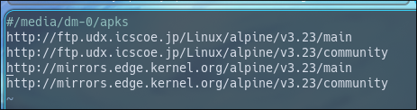

Luego corremos un apk update e instalamos el paquete arp-scan, vemos cómo con esto funciona correctamente. Solo necesitamos también cambiar la ruta, la cual ahora será /sbin/arp.

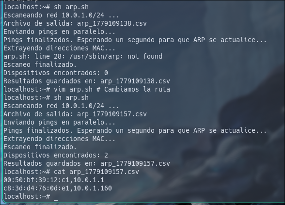

Con esto, el script funciona correctamente en Alpine Linux

** Cuentas de usuario

Si corremos este comando a ciegas, nos toparemos con el siguiente error:

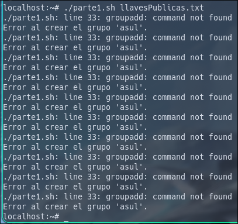

Esto ocurre porque Alpine Linux, al utilizar Busybox para funcionar, omite varias utilidades que en otros sistemas podríamos considerar esenciales. Una de estas es directamente groupadd.

Para solucionar esto tenemos dos opciones: trabajar con la alternativa proporcionada por Busybox para realizar esta acción (addgroup), o instalar groupadd. Para no enfrentarnos con problemas respecto a la sintaxis esperada por el comando alternativo, decidimos decantarnos por la segunda opción.

El comando groupadd está incluído dentro del paquete ~shadow~, el cual podemos instalar con apk.

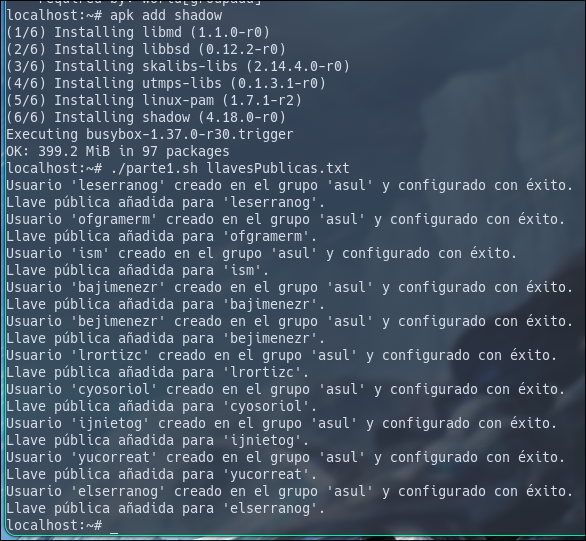

Hecho esto, observamos que el comando funciona de manera adecuada.

** Conexiones SSH

Este script no lo podríamos probar de la manera correcta, ya que sería necesario que las máquinas a las que nos conectamos sigan existiendo. Pero podemos correr el comando y ver si retorna algún error que sea ajeno a esta condición desafortunada.

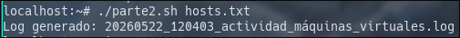

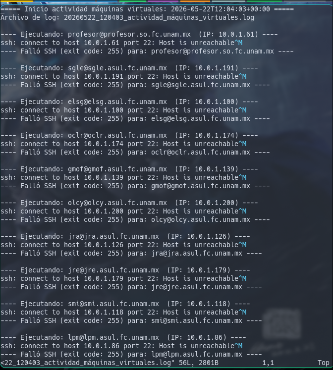

Funciona correctamente, principalmente porque sólo usa un comando: ssh. El resto es sintaxis de bash.

** Práctica 1

Esta práctica consistía en editar los repositorios en el sistema RHEL para que su gestor de paquetes (dnf) pudiera funcionar.

En el caso de Alpine Linux, su equivalente es apk. Al igual que dnf, tiene una lista de repositorios editable, la cual podemos modificar en ~/etc/apk/repositories~

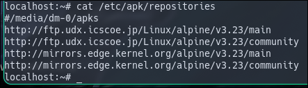

** Práctica 2

*** Revisión de Kernel

El comando para revisar la versión del kernel es el mismo. Aquí podemos observar que Alpine Linux utiliza el kernel 6.18.23 en su versión LTS (Long Term Support)

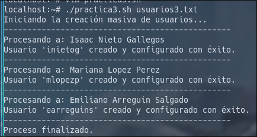

*** Cambio de password

Reinciamos la máquina para acceder al menú de GRUB. Las capturas de este procedimiento serán con cámara porque el reinicio será en el bare metal.

*inserta imagen wei*

Y agregamos la linea correspondiente, al hacer esto y presionar F10 podemos entrar a la sesión como root.

*inserta imagen wei*

El problema es que el sistema de archivos fue montado en modo sólo lectura, así que tenemos que correr el comando ~mount -o remount,rw /~ para que el comando passwd pueda funcionar correctamente. Una vez hecho esto, observamos que podemos modificar la contraseña sin problemas. En esta distribución no necesitamos hacer los pasos relacionados a SELinux, porque Alpine no tiene instalada esta utilidad.

*inserta imagen wei*

Reiniciamos e iniciamos sesión con la nueva contraseña, veremos que funcionó.

*inserta imagen wei*

** Práctica 3

*** Script para creación de usuarios masiva

Este script es muy parecido al utilizado en [[Cuentas de usuario]] para crear cuentas. Excepto que este recibe como entrada un archivo con líneas del tipo:

#+begin_quote
Nombre Apellido1 Apellido2 ; Contraseña
#+end_quote

Si lo corremos, funciona sin problemas:

*** Archivos de administración de usuarios

En todas las distribuciones Linux los archivos ~/etc/passwd, /etc/shadow, /etc/group, /etc/login.defs~ funcionan para lo mismo. Entonces, esto no cambia.

*** Creación de cuentas de usuario y directorio compartido

Usamos las cuentas del ejercicio anterior y creamos el directorio compartido. Copiamos todos los comandos utillizados en la práctica original sin realizar ningún cambio. Efectivamente todos funcionaron y rindieron el resultado final esperado.

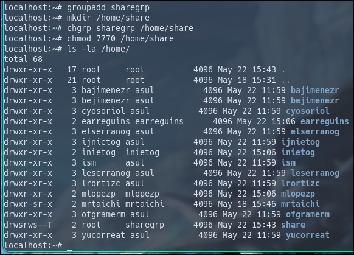

** Practica 4

*** Uso de telnet

Para configurar un servidor telnet en Alpine, necesitamos el paquete ~busybox-extras~. Una vez instalado, es tan fácil como correr el comando ~telnetd~.

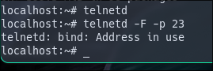

Para verificar, nos conectamos desde mi máquina personal.

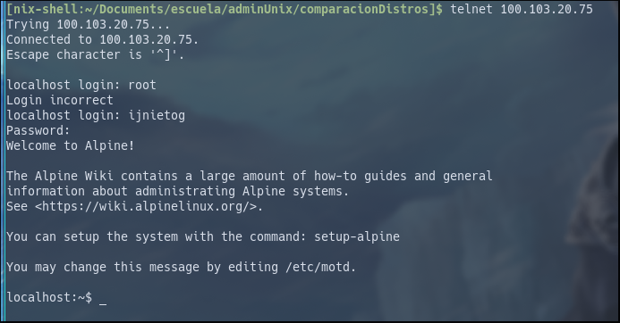

*** SSH

El servicio SSH que existe en Alpine es la implementación de GNU, por lo que el archivo de configuración funciona idéntico a lo especificado por esta práctica. Podemos realizar todas las pruebas necesarias y funcionaría sin problemas.

De hecho, actualmente estoy corriendo este servicio con el root login habilitado para conectarme remotamente desde mi ordenador.

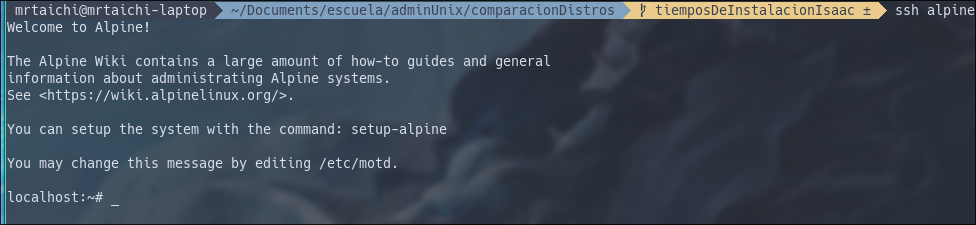

Y el archivo de configuración:

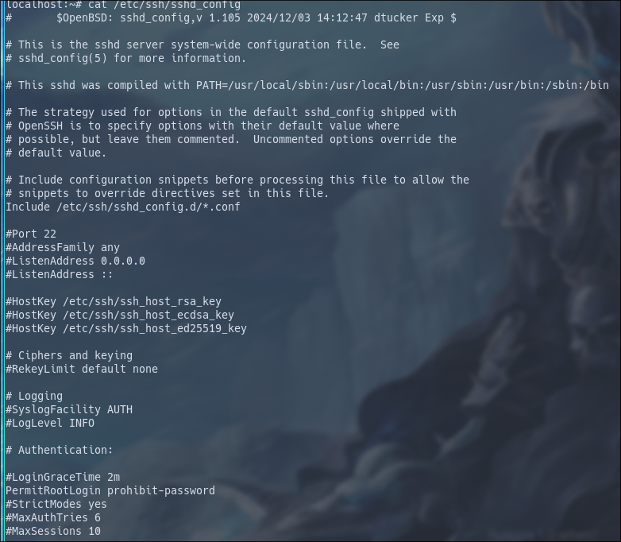

* Debian

*Lo de RHEL y FEDORA está en el LaTeX de mari*
